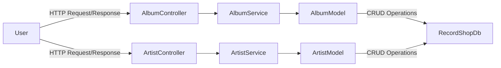
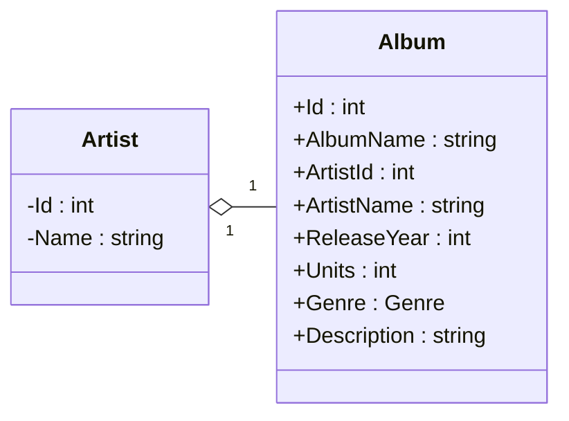

| Method Name | Method Endpoint | HTTP Method | Example Input |
| --- | --- | --- | --- |
| GetAlbums() | "api/album" | Get | - |
| GetAlbumById() | "api/album/{id}" | Get | Param: "api/album/3" |
| PostAlbum() | "api/album" | Post | Post body: { "albumName": "Cheat Codes", "artistName": "Danger Mouse", "releaseYear": 2022, "units": 6, "genre": "HipHop", "description": "Collaboration album with Black thought" } |
| PutAlbum() | "api/album/{id}" | Put | Post body: { "albumName": "Cheat Codes", "artistName": "Danger Mouse", "releaseYear": 2022, "units": 6, "genre": "HipHop", "description": "Collaboration album with Black thought" }   Param: "api/album/1" |
| DeleteAlbum() | "api/album/{id}" | Delete | Param: "api/album/2" |
| GetAlbumsByArtist() | "api/album/albumsbyartist/{artistName}" | Get | Param: "api/album/Danger Mouse" |

