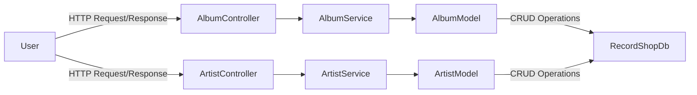
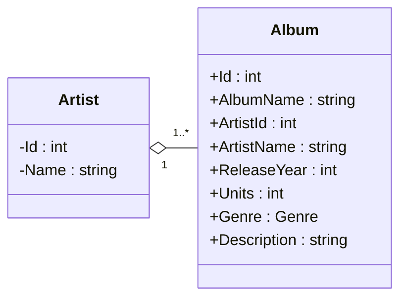

# Record Shop

An ASP.NET RESTful API using the MVC pattern. This API allows you to make HTTP requests to perform CRUD operations on an SQL Database of Artists and Albums.

## Project Flowchart

## Class Diagram

## API Endpoints Available:

| Method Name | Method Endpoint | HTTP Method | Example Input |
| --- | --- | --- | --- |
| GetAlbums() | "api/album" | Get | - |
| GetAlbumById() | "api/album/{id}" | Get | Param: "api/album/3" |
| PostAlbum() | "api/album" | Post | Post body: { "albumName": "Cheat Codes", "artistName": "Danger Mouse", "releaseYear": 2022, "units": 6, "genre": "HipHop", "description": "Collaboration album with Black thought" } |
| PutAlbum() | "api/album/{id}" | Put | Post body: { "albumName": "Cheat Codes", "artistName": "Danger Mouse", "releaseYear": 2022, "units": 6, "genre": "HipHop", "description": "Collaboration album with Black thought" }   Param: "api/album/1" |
| DeleteAlbum() | "api/album/{id}" | Delete | Param: "api/album/2" |
| GetAlbumsByArtist() | "api/album/albumsbyartist/{artistName}" | Get | Param: "api/album/Danger Mouse" |

## Set-up:

- You will need an IDE for running C# .NET applications and SQL server installed
- Fork the repo and clone it onto your local machine
- Run Program.cs
- Test endpoints using Swagger or Postman

## Further Development:
- Add additional testing
- Add additional functionality and more requests
- Add middleware, auth, rate limiting etc.
- Add fully functional frontend
- Add health checks
- Add a patch request as alternative to put
- Add Caching to reduce unneccessary database calls
